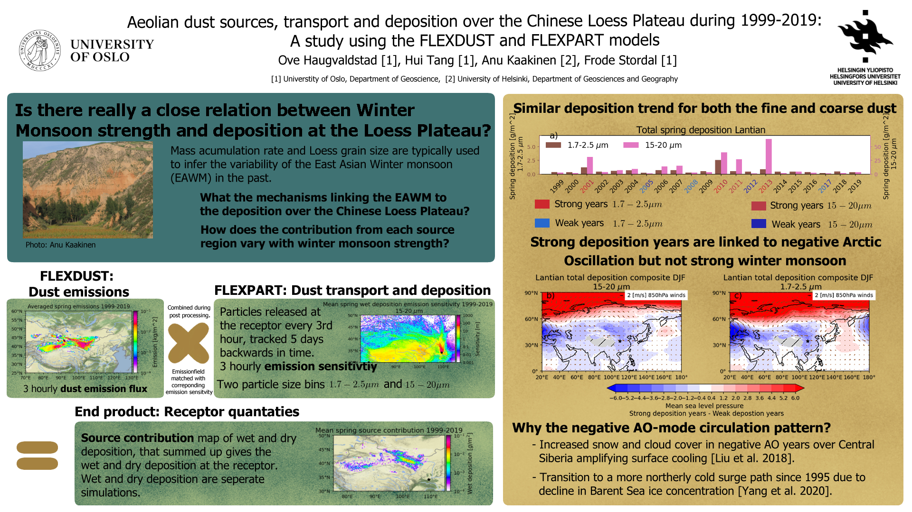

The virtual EGU 2021 general assembly was my first time attending a science conference. I presented the research 
I have done during my Master thesis on modelling of transport and deposition of aeolian dust 
over the Chinese Loess Plateau and in particular I have been examining the linkage between the 
East Asian Winter Monsoon and deposition over Chinese Loess Plateau. If you would like
to know more I made a recording where I go into more details (scroll down to the bottom).

## vEGU 2021 left me disappointed.
I had big expectations going into to the conference and put a lot of effort into making a nice slide and rehearsing my talk. 
As any first time attendee I was nervous during moments leading up to the time I was going to hold my 2 minutes presentation. 
Then it was my turn, I unmuted myself (at least I didn't forget that :sweat_smile: ) and began on the talk I had rehearsed so many times during the day before. It felt 
like two minutes were over before  knew they had started and I felt pretty good about my performance.      
Even though this EGU had 

## What I learned from EGU


